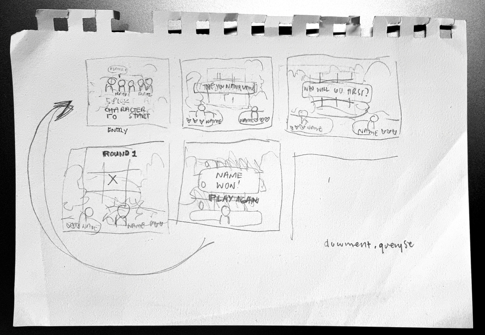
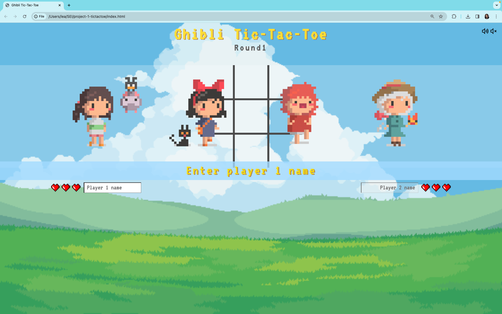
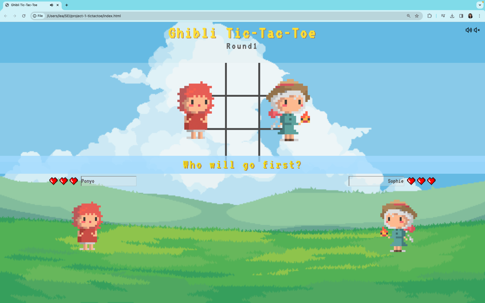
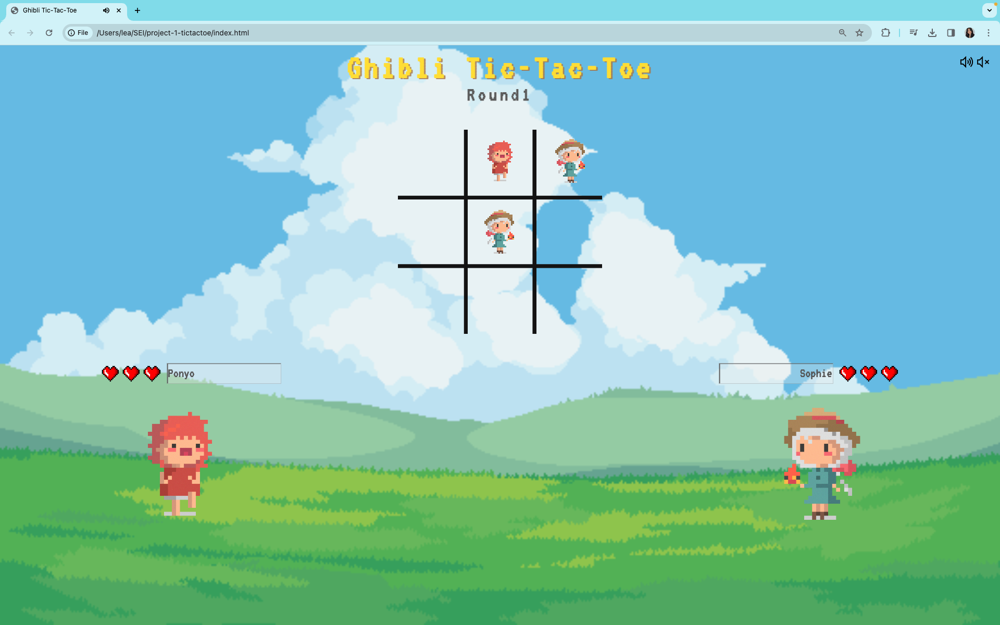
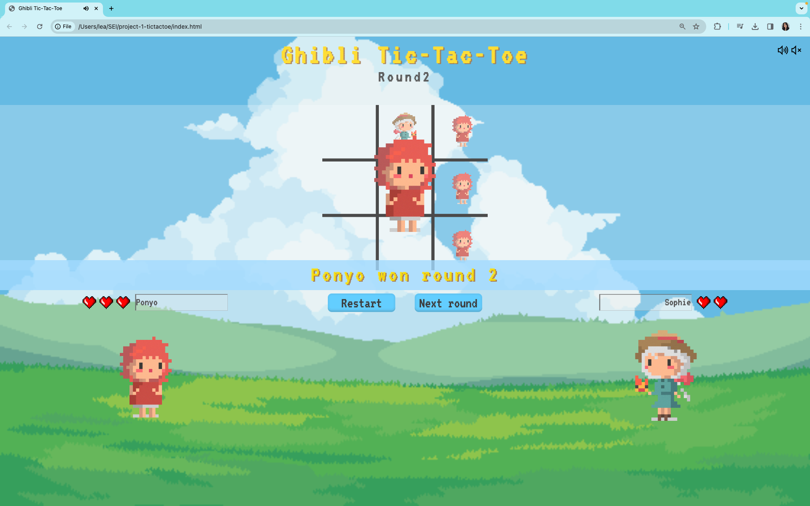
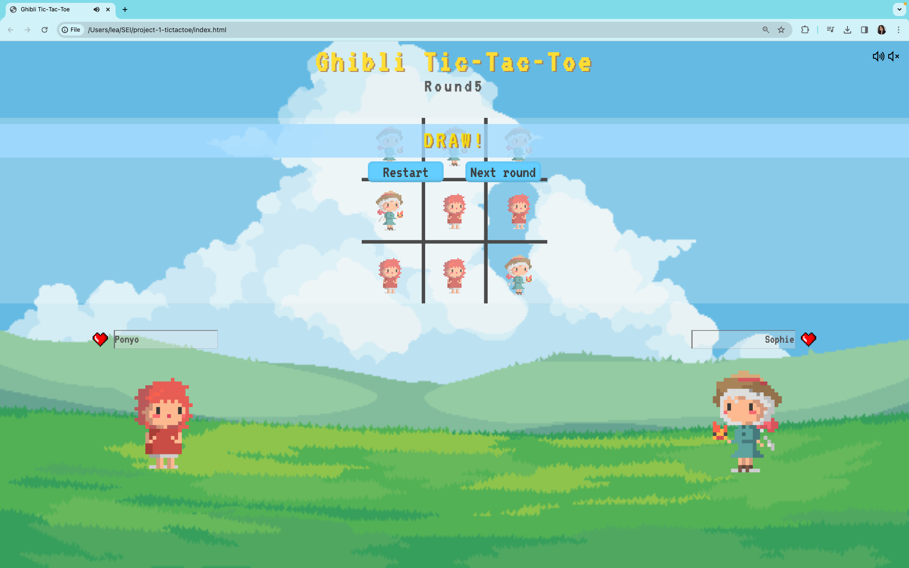
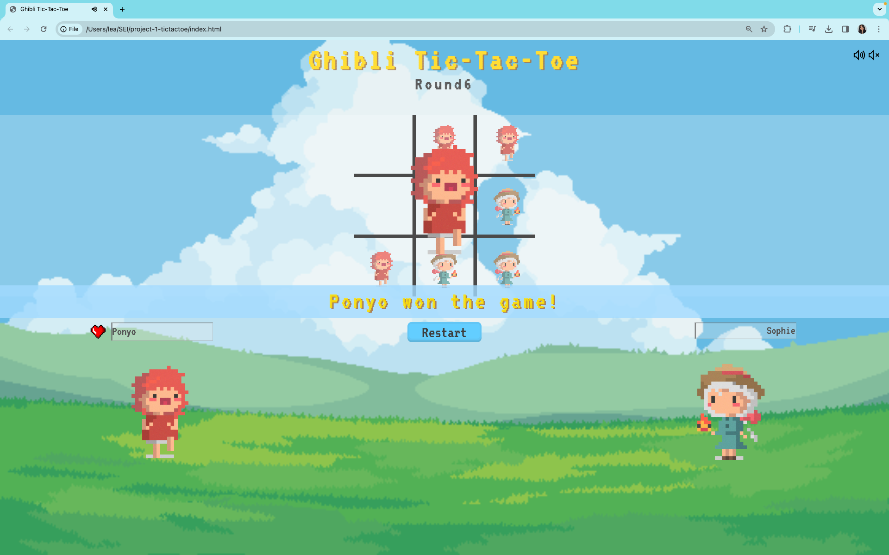

## [Play now!](https://marianlea.github.io/tic-tac-toe/)

# TicTacToe - Project1

## About

A simple Tictactoe game that gives off a nice and responsive interface for users to enjoy.

## Technologies:
* HTML
* CSS
* Vanilla JavaScript

## Features
* **Player Name Inputs**
* **Avatar Token Option** _:let players choose who goes first_
* **Game Round Counter**
* **Score Display** _:hearts display to show player points_
* **Message Display** _:prompts round winner and overall game winner_
* **Next Button**  _:starts another round_
* **Restart Button** _:restarts the game_
* **Hover Animation**
* **Background Music**
* **Play Background Music Button**
* **Mute Background Music Button**

### Approach
In making the game, I made sure to finish the game logic and functions first. Afterwards, I planned out the features that I wanted in the game and then made the game layout. Lastly, I finished the project with adding the visuals and sounds. 

Subsequently, for each feature that I added, I made sure that the feature is debugged (e.g. when choosing token on who goes first, everything else on the screen is unclickable) before moving on to adding the next feature for easier debugging.

### Wireframes

### In-game Photos

